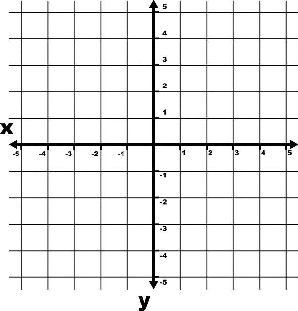

# Lighthouse Labs Challenge - Fall 2019
https://coding-challenge.lighthouselabs.ca

Copying my answers here and updating them as I progress through the challenge.

### Challenges
Information from the [Lighthouse Labs Coding Challenge Website](https://coding-challenge.lighthouselabs.ca).

#### Challenge #1 - Door to Door
Our challenge begins in Codeville, a small but thriving town in Serverside, Canada, where you are the current mayor nearing the end of your first term. Election season is nearing, and this town needs you, so you've decided to run for a second term. However, you need some help to make sure the election and your campaign run smoothly. Enter JavaScript, a coding language sure to help you optimize the many elements of the upcoming election and (hopefully) secure your return as Mayor.

As your election campaign ramps up, you plan to go door to door to talk to the citizens of Codeville. There are quite a few neighbourhoods in Codeville, but lucky for you, we have a dedicated crew of volunteers to help out. Being the fair Mayor that you are, you want to make sure the work is distributed evenly between the team. Let's figure out how many neighbourhoods each volunteer should visit.

##### Instructions
Given an array of volunteer names and an array of neighbourhood names, complete the `doorToDoor` function so that it returns the number of neighbourhoods each volunteer should visit if the work of going door to door is split evenly amongst them.

##### Examples

###### Input:
```
const volunteers = [
    'Sally',
    'Jake',
    'Brian',
    'Hamid'
];


const neighbourhoods = [
    'Central Valley',
    'Big Mountain',
    'Little Bridge',
    'Bricktown',
    'Brownsville',
    "Paul's Boutique",
    'Clay Park',
    'Fox Nest'
];
```

###### Output:
```
2
```

#### Hint
We can use JavaScript's handy built-in [.length](https://developer.mozilla.org/en-US/docs/Web/JavaScript/Reference/Global_Objects/Array/length) method to get the length of each array! This will help you figure out how many volunteers and how many neighbourhoods there are.

#### Tests
- The doorToDoor function should return the number of neighbourhoods divided by the number of volunteers.

#### Challenge #2 - Something to Talk About
Thanks to your tireless volunteers, the word is out that you're running for a second term, and the local media has come calling!

The Lighthouse Gazette wants to interview you about your campaign, but you're a nervous interviewer! To help prepare for your interview you want to use JavaScript to practice campaign stance on important election topics. The list of possible question categories includes:

- arts funding
- economy
- transportation

##### Instructions
Given a question topic, complete a function `interviewAnswer(topic)` that returns your stance on that particular election issue. The answer should be returned as a string.

- When asked about arts funding, the function should return `"We'll have to get creative!"`
- When asked about the economy, the function should return `"Time is money."`
- When asked about transportation, the function should return `"It's going to be a long road, so we better get moving."`

If you're asked about a topic that isn't in the list above, respond with a default statement. (For example, "QUACK!")

##### Examples

###### Input:
```
const topic = 'economy'
```

###### Output:
```
Time is money.
```

###### Input:
```
const topic = 'transportation'
```

###### Output:
```
It's going to be a long road, so we better get moving.
```

#### Hint
We can use [if-statements](https://developer.mozilla.org/en-US/docs/Web/JavaScript/Reference/Statements/if...else) to return different responses depending on what topic is passed as a parameter. We may also want to look at [comparison operators](https://developer.mozilla.org/en-US/docs/Web/JavaScript/Reference/Operators/Comparison_Operators) while we're at it.

#### Tests
- The interviewAnswer function return a response for each topic question.
- The interviewAnswer function should return the correct response for each topic question.
- The interviewAnswer function should return a default statement for topics that aren't in the list.

#### Challenge #3 - Securing the Vote
It looks like you've got a hold of your campaign for now. So you've been asked to turn your attention to making sure the election infrastructure is ready to go! Codeville County is using a new e-voting platform to make elections simpler and more secure. We need to test out the software to make sure it's working correctly before Election Day.

##### Instructions
When a resident casts their vote, the system will be passed the name of the candidate they voted for and the current standings. It will then update the standings, adding the new vote to the count.

To test the system, we'll need to complete the function `castVote(name, votes)` that takes in the name of a candidate and an array of tallied `votes`. The function should return an array with the updated standings.

We will be testing the system with three possible candidates: Tim, Sally and Beth. Each item in the votes array represents the number of votes for a particular candidate:

- The first item in the array `votes[0]` are the votes for Tim
- The second item in the arry `votes[1]` are the votes for Sally
- The third item in the array `votes[2]` are the votes for Beth

For example in this array `[0, 2, 1]` there are 0 votes for Tim, 2 votes for Sally and 1 vote for Beth.

##### Examples

###### Input:
```
const name = 'Sally';
const votes = [
  0, // Tim
  2, // Sally
  1 // Beth
]
```

###### Output:
```
[
  0, // Tim
  3, // Sally
  1 // Beth
]
```

###### Input:
```
const name = 'Tim';
const votes = [
  1, // Tim
  1, // Sally
  2 // Beth
];
```

###### Output:
```
[
  2, // Tim
  1 // Sally
  2 // Beth
]
```

#### Hint
We'll need to start with an `if statement` to determine who the vote is for. Once we know that we can use the increment operator (++) to increase `votes[0]` for Tim, `votes[1]` for Sally or `votes[2]` for Beth.

For instance, if `name === 'Tim'`, then we want to increment `votes[0]++`.

#### Tests
- The castVote function should return an array.
- The castVote function should return an array with 3 elements.
- The castVote function should increment the correct value.

#### Challenge #4 - This is How You Remind Me (To Register To Vote)
Now that you've squashed all the bugs in the city's new voting software, it's time to jump back on the campaign trail. The election is coming up soon! You need to send out reminders to all Codeville citizens to encourage them to vote, but you don't want to spam people who have already registered. Use JavaScript to remove all registered voters from your contact list.

##### Instructions
Complete the function `registerToVote(name, unregisteredVoters)` that takes in the name of a newly registered voter and an array of names of those who have not yet registered to vote. Your function must return an array, with the newly registered voter's name removed.

##### Examples

###### Input:
```
const name = 'Bradley';
const unregisteredVoters = ['Jake', 'Alanna', 'Bradley', 'Stephanie'];
```

###### Output:
```
['Jake', 'Alanna', 'Stephanie']
```

#### Hint
If we initialize a new empty array within our function, `let mailingList = []`, we can use a ][for-loop](https://developer.mozilla.org/en-US/docs/Web/JavaScript/Guide/Loops_and_iteration#for...of_statement) and an [if-statement](https://developer.mozilla.org/en-US/docs/Web/JavaScript/Reference/Statements/if...else) to push the right names into it.

Or if we're feeling adventurous, let's take a look at JavaScript's [filter](https://developer.mozilla.org/en-US/docs/Web/JavaScript/Reference/Global_Objects/Array/filter) function. You can see an example of how to remove an item from an array using filter [here](https://stackoverflow.com/a/20690490).

#### Tests
- The registerToVote function should return an array.
- The registerToVote function should remove an element from the array.

#### Challenge #5 - Voting Station Calculation
The election is looming, and the dutiful City of Codeville staff has finalized most of the details, except for one thing: where will citizens vote? There are hundreds of buildings in town, but there are very specific requirements for what constitutes an acceptable voting station. With very little time to decide, the city needs our help to sort through the building data.

##### Instructions
Complete the function `chooseStations(stations)` that takes in an array of possible voting stations, and then only returns the names of the stations that are appropriate.

Your function will receive an array of stations, where each station itself is an array with a name, a capacity, and a venue type.

In order for a station to be deemed appropriate, it must have a **capacity of at least 20**, and be a **school** or **community centre**.

##### Examples

###### Input:
```
const stations = [
  ['Big Bear Donair', 10, 'restaurant'],
  ['Bright Lights Elementary', 50, 'school'],
  ['Moose Mountain Community Centre', 45, 'community centre']
];
```

###### Output:
```
['Bright Lights Elementary', 'Moose Mountain Community Centre']
```

#### Hint
You'll need to try out some new [comparison operators](https://developer.mozilla.org/en-US/docs/Web/JavaScript/Guide/Expressions_and_Operators#Comparison) for this. Take a look at how to do greater-than, not-equal, and logical-AND with JavaScript.

Much like the previous challenge, one way we could solve this is by initializing a new array within our function (`let goodStations = []`) and [push](https://www.w3schools.com/jsref/jsref_push.asp) the stations that meet the requirements to it as we loop through them.

**See two of the Lighthouse Labs team pair program this challenge below:**
<https://www.youtube.com/watch?v=16UXovpvyf8>

#### Tests
- The chooseStations function should return an array.
- The chooseStations should return an array of strings.
- The chooseStations should return only the appropriate stations.

#### Challenge #6 - Turn Out for What
Phew, with our help the city staff were able to select the voting stations on time and the election went off without a hitch! Now that the votes have been cast, the Election staff needs to verify the votes by matching each voter's signature to their voter ID.

##### Instructions
Complete the function `voterTurnout()`, that will take in two arrays. The first array is a list of voter ids, and the second array is a list of voter signatures, which correspond to the voter ids. Our task here is to first check that each array have the same number of items and then confirm that each of the voter ids matches the corresponding voter signature.

If the arrays do not contain the same number of items, then we know something is amiss and our function should return `false`. If they contain the same number of elements, then we should proceed to check if the two arrays are identical, meaning they contain the **same names in the same order**. If they are, our function should return `"All clear, we can count the votes!"`, if they are not it should return `"FRAUD!"`.

##### Examples

###### Input:
```
const voter_signatures = [
  'Bill Billiamson',
  'Kate Etak',
  'Brandon Brandonus',
  'Fake McFakerson',
  'Jane Janesford'
]

const voter_ids = [
  'Bill Billiamson',
  'Kate Etak',
  'Brandon Brandonus',
  'Simon Simonson',
  'Jane Janesford'
]
```

###### Output:
```
FRAUD!
```

###### Input:
```
const voter_signatures = [
  'Bill Billiamson',
  'Kate Etak',
  'Brandon Brandonus',
  'Simon Simonson',
  'Jane Janesford'
]

const voter_ids = [
  'Bill Billiamson',
  'Kate Etak',
  'Brandon Brandonus',
  'Simon Simonson',
  'Jane Janesford'
]
```

###### Output:
```
'All clear, we can count the votes!
```

#### Hint
We need to determine if the two arrays are identical by comparing them to one another. First, we'll need to make sure they are the same length. We can do this by using [.length](https://developer.mozilla.org/en-US/docs/Web/JavaScript/Reference/Global_Objects/Array/length) and the strict inequality (`!==`) operator.

Next, we'll need to loop through one of the arrays, comparing each item of one array to the same item in the second array using the index. You can a see step by step breakdown of how to compare two arrays [here](https://gomakethings.com/how-to-check-if-two-arrays-are-equal-with-vanilla-js/)

#### Tests
- If the signatures do not match the ids the voterTurnout function should return "FRAUD!".
- If all of the signatures match the ids the voterTurnout function should return "All clear, we can count the votes!".
- If the voter ids array and voter signatures array are not the same length, return false

#### Challenge #7 - You Choose, (You Don't) Lose
The people of Codeville have spoken, and you have been elected mayor once again! Now it's time to get back to work. You need to decide which issues to focus on first for your new term in office. Using the dataset from voter surveys, determine the top three issues voters were most concerned about when choosing the new Codeville leadership.

##### Instructions
We need to go through the survey responses to see what your constituents would like you to focus on over the course of your term in office. The array that you are given contains many phrases and words pulled from a number of interviews. We only want to focus on the following three key phrases: "smart city", "arts funding", and "transportation".

Our `termTopics` function needs to count how many times each of those topics was mentioned in the surveys, and then return an array with the number of mentions in the following order: `smart city`, `arts` `funding`, and then `transportation`.

##### Examples

###### Input:
```
const interviews = [
  'smart city',
  'rebuild the lighthouse',
  'arts funding',
  'transportation',
  'arts funding',
  'rebuild the lighthouse',
  'sports funding',
  'tax cuts',
  'smart city',
  'arts funding',
  'smart city'
]
```

###### Output:
```
[
  3, // smart city
  3, // arts funding
  1  // transportation
]
```

#### Hint
Similar to yesterday's question, we may need a for-loop to go through each entry in the interview responses.

Whenever we need to decide which value to increase, we could use an if-statement or switch statement to make that decision.

#### Tests
- The termTopics function should return an array.
- The termTopics function should return an array of numbers.
- The termTopics function should return the correct mention count for each topic.

#### Challenge #8 - Trash to Treasure
The results are in, and the people of Codeville want you to focus on Smart City upgrades. You've decided to begin by replacing all of the city's trash cans with smart cans: when citizens toss their rubbish into the smart can, it automatically sorts items into waste, recycling, and compost bins.

##### Instructions
We need to complete a function called `smartGarbage(trash, bins)`, which will be responsible for increasing the garbage count for waste, recycling, or compost depending on what trash is submitted. Our function will receive two arguments. The first argument, `trash`, is a string that will tell our function what type of item is being submitted. The second argument, `bins`, is an object containing three properties (waste, recycling, and compost), which hold some numerical value. Our function must increase the correct value in the `bins` object, and the return the newly updated object.

##### Examples

###### Input:
```
const bins = {
    waste: 4,
    recycling: 2,
    compost: 5
}

const trash = 'recycling'
```

###### Output:
```
{
        waste: 4,
        recycling: 3,
        compost: 5
    }
```

#### Hint
This is the first time we've encountered objects! We will need to access the proper value in the bins object using the `trash` as the key. If you're having trouble with this, take a look online to see how to use [square bracket notation](https://developer.mozilla.org/en-US/docs/Web/JavaScript/Reference/Operators/Property_accessors) to access values in a JavaScript object.

Note: When we’re referencing a variable in the bracket notation, we can skip the quotes.

#### Tests
- The smartGarbage function should return an object
- The smartGarbage function should return an object with properties for waste, recycling, and compost
- The smartGarbage function increases the appropriate property
- The smartGarbage function does not alter the wrong properties

#### Challenge #9 - Driving Mayor Daisy
As Mayor, you want one of your legacies to be bettering street design enough to improve traffic flow and reduce congestion. You've decided to start by installing special sensors on some streets to monitor how often cars pass by, and track their speeds.

##### Instructions
Complete the function, `carPassing(cars, speed)`, that takes in an array of car objects, and the speed of a car as it passes the sensor. This function should create a new object with with a property called speed, and another property called time and add it to the cars array. We can retrieve the current time, for setting the `time` property, by using the `Date.now()` function, which is built into JavaScript!

Our function should return an array that includes all of the elements in `cars` as well as our new element.

##### Examples

###### Input:
```
const cars = [
  {
    time: 1568329654807,
    speed: 40,
  },
  {
    time: 1568329821632,
    speed: 42,
  },
  {
    time: 1568331115463,
    speed: 35
  }
]

const speed = 38
```

###### Output:
```
[
      {
        time: 1568329654807,
        speed: 40,
      },
      {
        time: 1568329821632,
        speed: 42,
      },
      {
        time: 1568331115463,
        speed: 35
      },
      {
        time: 1568431216417,
        speed: 38
      }
    ]
```

#### Hint
We can define and create a new object with an object literal. You can check out the first list item [here](https://www.freecodecamp.org/news/a-complete-guide-to-creating-objects-in-javascript-b0e2450655e8/) as an example.

Like in previous challenges, we may need to use JavaScript's handy `push()` method to add our new object to the cars array.

#### Tests
- The carPassing function should return an array.
- The carPassing function should return an array with one new element.
- The newest item in the returned array should have the most recent datestamp.

#### Challenge #10 - Smartparking
The parking lot in the Codeville Devtropolis Shopping Mall needs an upgrade, and you've decided this is the perfect opportunity to install a smart parking system.

The system will use special parking sensors to keep track of all parking spots and monitor which ones are available. Every time a vehicle enters the parking lot, the system directs them to an available spot for their particular vehicle type, or notifies them that no spots are available.

##### Instructions
We need to write a function called `whereCanIPark()` that returns the coordinates of an available parking spot for the vehicle, or returns false if there is no available spot. Our function receives an array of arrays representing parking spots, and a string with type of the vehicle that is looking for a parking spot.

There are three kinds of possible vehicles: **regular** cars, **small** cars, and **motorcycles**. Regular cars can only park in **R** spots. Small cars can park in **R** or **S** spots. Motorcycles can park in **R**, **S**, or **M** spots. In the array of parking spots, spots are written in both lower-case and upper-case. An upper-case letter means that the particular spot is **AVAILABLE**, while lower-case letters mean that the spot is **UNAVAILABLE**.

Our function must return an array with the coordinates of the spot as an [X, Y] pair. See the example input and output below for an illustration.

**Note:** There may be multiple available spots for a particular vehicle. It does not matter which spot your function chooses, as long as the spot is available. And if there are no available spots, remember to return false.

##### Examples

###### Input:
```

    const spots = [
      // COLUMNS ARE X
      //    0    1    2    3    4    5
          ['s', 's', 's', 'S', 'R', 'M'], // 0 ROWS ARE Y
          ['s', 'M', 's', 'S', 'R', 'M'], // 1
          ['s', 'M', 's', 'S', 'R', 'm'], // 2
          ['S', 'r', 's', 'm', 'R', 'M'], // 3
          ['S', 'r', 's', 'm', 'R', 'M'], // 4
          ['S', 'r', 'S', 'M', 'M', 'S'], // 5
      ]

      const vehicle = 'regular' // possible options are 'regular', 'small', or 'motorcycle'

```

###### Output:
```
[4, 0]
```

#### Hint
To go through a single array, we can use a single for-loop. To go through every element in an array of arrays, we can use [two for-loops](https://www.youtube.com/watch?v=VY0a-w605-c): one nested within the other.

**See two of the Lighthouse Labs team pair program this challenge below:**
<https://www.youtube.com/watch?v=PU4xyyg2uGA>

#### Tests
- The whereCanIPark function returns an array, or false
- The whereCanIPark function returns a correct available spot
- The whereCanIPark function returns false if there is no available spot

#### Challenge #11 - You Can't Hurry Transit
You can't hurry love, or local transit in Codeville. While you've been hard at work on a solution to the larger transit woes, you've decided to implement a new system to at least be a little more transparent about wait times. The city will be installing a smart screen, at the busiest bus stop in town, that will show the estimated arrival times for each of the buses that stop there.

##### Instructions
For this challenge, we'll implement a function called `busTimes()`. This function will calculate the arrival time for a collection of busses based on their current speed and distance from the stop. It will receive an object called `buses`, which contains a series of objects for each bus, with the distance of the bus and the speed that the bus is traveling at. Our function should return a new object that shows how long until each bus arrives at the stop.

##### Examples

###### Input:
```
const buses = {
      pickadilly: {
          distance: 10,
          speed: 5
      },
      uptown: {
          distance: 13,
          speed: 10
      }
    }
```

###### Output:
```
    {
      pickadilly: 2,
      uptown: 1.3
    }
```

#### Hint
We'll need to loop through each of the buses in the buses object. Looping through objects can be done with a [for...in](https://developer.mozilla.org/en-US/docs/Web/JavaScript/Reference/Statements/for...in) loop!

We can calculate the arrival time of the bus by dividing it's distance by it's speed.

#### Tests
- busTimes returns an object
- The resulting object must have a property for each bus
- The resulting object must have numbers as the values
- The resulting values are correct


#### Challenge #12 - In the Air Tonight
The citizens of Codeville seem pleased with all the upgrades you're making to the local infrastructure. Next on your list to tackle is the air quality. You've decided that you want to install air pollution sensors around the city to monitor air quality and identify problem areas. We need to write the code for the sensors to trigger a special message when the air is too polluted.

##### Instructions
For this challenge we will implement a function called `checkAir()`, which will check a collection of air samples. The function will take in two arguments. The first argument is an array of strings, where each string represents a small air sample that is either `clean` or `dirty`. The second argument is a number representing the highest acceptable amount of dirty samples. For example, a threshold of 0.4 means that there must be less than 40% of total samples classified as dirty for our air to be considered clean. Our function must return `Polluted` if there are too many dirty air samples, or `Clean` if the proportion of dirty samples is below the threshold.

##### Examples

###### Input:
```
const samples = ['clean', 'clean', 'dirty', 'clean', 'dirty', 'clean', 'clean', 'dirty', 'clean', 'dirty']
    const threshold = 0.3
```

###### Output:
```
Polluted
```

#### Hint
Not sure where to get started? It might be useful to start by creating a variable to keep track of how many dirty samples we find as we loop through the array of samples. We can increment or add to this number using the ++ operator.

Once you know how many dirty samples there are, we just need to do some simple math to determine if it exceeds the threshold.

#### Tests
- The testAir function should return a string
- The returned string should be either "Polluted" or "Clean"
- If there are too many dirty samples, then the function should return "Polluted"
- If the ratio of dirty samples is below the threshold, return "Clean"

#### Challenge #13 - All of the Lights
To make late-night driving and walking safer(and to save the city energy), you've decided to install smart street lights. These lights turn on and off automatically when they sense someone near by.

You'll need to use JavaScript to create some of the functionality to control the lights.

##### Instructions
We will be implementing this using **three** functions.

The first two functions will receive an array of objects that represent street lights which may be `on` or `off`.

- Our first function, `lightsOn`, must set all of the lights to `on` and then return the array of lights.
- The second function, `lightsOff`, must set all the lights to "off" and then return the array of lights.
- The third function, `toggleLights`, will receive an array of many street lights, as well as a boolean value `lightsAreOn` which tells you whether or not all the lights are currently `on`. If `lightsAreOn` is true, your function should turn all of the lights off. If `lightsAreOn` is false, your function should turn all of the lights on.

##### Examples

###### Input:
```
    // for lightsOff() function
    const lights = [
      {
          id: 1,
          on: true
      },
      {
          id: 2,
          on: true
      },
      {
          id: 3,
          on: true
      },
      {
          id: 4,
          on: true
      },
      {
          id: 5,
          on: true
      }
    ]
```

###### Output:
```
[
      {
          id: 1,
          on: false
      },
      {
          id: 2,
          on: false
      },
      {
          id: 3,
          on: false
      },
      {
          id: 4,
          on: false
      },
      {
          id: 5,
          on: false
      }
    ],
```

###### Input:
```
// for lightsOn() function
    const lights = [
      {
          id: 1,
          on: false
      },
      {
          id: 2,
          on: false
      },
      {
          id: 3,
          on: false
      },
      {
          id: 4,
          on: false
      },
      {
          id: 5,
          on: false
      }
    ]
```

###### Output:
```
[
      {
          id: 1,
          on: true
      },
      {
          id: 2,
          on: true
      },
      {
          id: 3,
          on: true
      },
      {
          id: 4,
          on: true
      },
      {
          id: 5,
          on: true
      }
    ]
```

###### Input:
```
    // for toggleLights() function
    const lights = [
      {
          id: 1,
          on: true
      },
      {
          id: 2,
          on: true
      },
      {
          id: 3,
          on: true
      },
      {
          id: 4,
          on: true
      },
      {
          id: 5,
          on: true
      }
    ]

    const lightsAreOn = true
```

###### Output:
```
[
      {
          id: 1,
          on: false
      },
      {
          id: 2,
          on: false
      },
      {
          id: 3,
          on: false
      },
      {
          id: 4,
          on: false
      },
      {
          id: 5,
          on: false
      }
    ]
```

#### Hint
Lucky for us, we can call any of the functions that we have made before `toggleLights`. Can you see where we might want to call our `lightsOn` or `lightsOff` functions?

#### Tests
- The lightsOn function returns an array
- The lightsOn function returns an array with an unchanged number of elements.
- The lightsOn function returns an array with all of the lights turned "on"
- The lightsOff function returns an array
- The lightsOff function returns an array with an unchanged number of elements.
- The lightsOff function returns an array with all of the lights turned "off"
- The toggleLights function returns an array
- The toggleLights function returns an array with an unchanged number of elements.
- If the toggleLights function receives lightsAreOn = true, all the lights should then be turned OFF

#### Challenge #14 - Ticket to Ride
The local transit system has been too expensive for too long! To encourage more people to use the bus, you are restructuring ticket pricing. From now on, passengers will be charged a dynamic price, which will depend on the number of people on the bus (peak times have higher fare!) and the distance that the passenger travels.

##### Instructions
We'll be implementing a function called `dynamicPricing()`, which will return the cost of a particular trip given the number of people on the bus, and the distance traveled by the passenger. This function receives two numbers: `numberOfPeople` and `distanceTraveled`.

The base ticket price is $1. Passengers will be charged $0.25 per kilometer. If there are 30 or more people on the bus, there should be $0.25 added to the total.

The value that your functions returns must be a string, formatted as such: $4.25. Your values must be shown to two decimal points of precision.

##### Examples

###### Input:
```
const numberOfPeople = 15
    const distanceTraveled = 10
```

###### Output:
```
$3.50
```

###### Input:
```
 const numberOfPeople = 35
    const distanceTraveled = 5
```

###### Output:
```
$2.50
```

#### Hint
There is a built-in JavaScript function called [.toFixed](https://developer.mozilla.org/en-US/docs/Web/JavaScript/Reference/Global_Objects/Number/toFixed), which will be useful here to help us round our result before returning it! Lucky for us, it also automatically returns a string.

#### Tests
- The dynamicPricing function returns a string
- The dynamicPricing function returns the correct value

#### Challenge #15 - X Marks the Perfect Shot 📸
With the city getting smarter, it's time to turn your focus to Codeville's biggest event of the year, the Harvest Festival! Each year, the Harvest Festival kicks off with a parade - and you want to make sure this is a show the townspeople will remember forever.

You've hired Daria Ducksworth, the town's best photographer, to capture the magic of the Harvest Festival Parade. She needs to track the coordinates of the floats to help her capture their best angles.

##### Instructions
For this challenge you'll have to implement a function called `finalPosition()`, which will calculate the position of the parade based on an array of directional moves. The parade will move on an X-Y grid like the following.



Your function will receive an array of moves, which are strings that say either `north`, `south`, `west`, or `east`, these represent the parade moving in a particular direction by a single space on the grid. By looking at the path that the parade moves in, your function should calculate and then return an array representing the position of the parade after completing all of the moves. The first element of the array should be the X position, and the second element of the array should be the Y position. The parade begins at `[0,0]`.

##### Examples

###### Input:
```
const moves = ['north', 'north', 'west', 'west', 'north', 'east','north']
```

###### Output:
```
[-1, 4]
```

#### Hint
One way to approach this is to start with an array at [0, 0], and then update the appropriate values while looping through the moves. See if you can get the final X value first!

#### Tests
- The function returns an array with two elements
- The proper X position is returned
- The proper Y position is returned

#### Challenge #16 - In Living Colour
It's time to order the banners and flags for the festival, and you need to decide on the key colour scheme.

You want to use colour theory to make sure the colours complement one another. To do so we'll need to choose a main colour and use code to determine the best complementary colours.

##### Instructions
We'll complete a function `festivalColours()` that calculates the [split complementary colours](https://www.w3schools.com/colors/colors_compound.asp) for a given colour. We'll be working with a special colour system called HSL, which stands for Hue, Saturation, and Lightness.

[Here's an example of an HSL colour picker.](http://hslpicker.com/)

The function will receive an `H(Hue)` value, and must return an array of the values for the two split complementary colours. The smaller number should be the first element, and the larger number should be the second element.

You can take a peek at [this website](https://www.ethangardner.com/articles/2009/03/15/a-math-based-approach-to-color-theory-using-hue-saturation-and-brightness-hsb/#split-complementary) for the formula you'll need to use to calculate the split complementary colours.

##### Examples

###### Input:
```
const color1 = 100
```

###### Output:
```
[250, 310]
```

#### Hint
Still not sure what a split-complementary colour scheme is? A split-complementary colour scheme is a three-color combination that consists of a base color and two colors that are 150 degrees and 210 degrees apart from the base respectively.

#### Tests
- festivalColours returns an array
- The first element in the returned array is the "smaller" split complementary color
- The second element in the returned array is the "larger" split complementary color

#### Challenge #17 - We're Rooting For You!
At this year's town festival the Codeville Vegetation Association will be handing out several awards for the best vegetables in a given category. We'll be testing out a new judging system on the best tomatoes to start, which can be judged based on their redness OR their plumpness.

##### Instructions
For this challenge, we'll need to implement a function called `judgeVegetable()`that will decide which vegetable is best based on a given judging characteristic. Our function will receive two parameters: a list of veggies(as an array of objects), and a characteristic to judge the veggies by (in the case of a tomato, either redness or plumpness).

Our function must return the name of the person who submitted (`vegetables.submitter`) the vegetable with the highest ranking in the provided category.

##### Examples

###### Input:
```
   const vegetables = [
      {
        submitter: 'Old Man Franklin',
        redness: 10,
        plumpness: 5
      },
      {
        submitter: 'Sally Tomato-Grower',
        redness: 2,
        plumpness: 8
      },
      {
        submitter: 'Hamid Hamidson',
        redness: 4,
        plumpness: 3
      }
    ]

    const metric = 'redness'
```

###### Output:
```
Old Man Franklin
```

#### Hint
This problem involves looping through an array of objects and determining which object has the highest rating in a given category. Solving this could include a for-loop to loop through the vegetables, comparing each by the given `metric` to find the highest one.

One way to start might be by initializing a variable called `bestVeggie` as `vegetables[0]` and then comparing each vegetable within our loop to the bestVeggie to determine if it is greater or not. If it is greater, then we've found ourselves a new `bestVeggie`.

#### Tests
- judgeVegetable should return a string
- judgeVegetable should return the name of the submitter of the highest rated veggie

#### Challenge #18 - In It to Win It
There are a number of different stands and games at this year's festival where the townspeople of Codeville can win raffle tickets! There are three different kinds of tickets someone can win, and they each correspond to a raffle. There are `red` tickets for the Red Robin Raffle, `green` tickets for the Green Machine Raffle and `blue` tickets for the Deep Blue Sea Raffle. The people of Codeville **love** games and always end up with a large number of tickets. So this year, we'll build a machine that not only sorts and counts the number of each ticket, but also tells people which raffle they have the best odds of winning based on the current entries.

##### Instructions
Our first function, `bestOdds()`, will receive two parameters. The first parameter will be an array of strings that are either `red`, `green`, or `blue`, representing the tickets that a particular person has. The second parameter is an object that shows how many entries there currently are for each raffle. By looking at the tickets that the particular person has, your function should return a string that lets the person know which raffle they have the highest chance of winning. The format of the response should be as follows (without the square brackets): `"You have the best odds of winning the [COLOUR] raffle."`

While we could do this all within the `bestOdds()` function, we want to keep our code [DRY](https://en.wikipedia.org/wiki/Don%27t_repeat_yourself), so we will also need to complete a helper function. This helper function `countTickets()` will be called from within `bestOdds()` and receive the array of strings that are either `red`, `green`, or `blue`. The function will count how many of each string there are, and then return an object with the individual counts.

##### Examples

###### Input:
```
// for bestOdds() function
const tickets = [
  'red',
  'red',
  'green',
  'blue',
  'green'
]

const raffleEntries = {
  red: 10,
  green: 30,
  blue: 15
}
```

###### Output:
```
"You have the best odds of winning the red raffle."
```

###### Input:
```
// for countVotes() helper function
const tickets = [
  'red',
  'red',
  'green',
  'blue',
  'green'
]
```

###### Output:
```
{
  red: 2,
  green: 2,
  blue: 1
}
```

#### Hint
Make sure to call the `countTickets(tickets)` function from within the `bestOdds()` function.

Each ticket count can start at 0. We can start our `countTickets()` function by creating an object that sets the counts for `red`, `green`, and `blue` to 0.

Because we need to go through the tickets array to look at each ticket, we can use a [for-loop](https://developer.mozilla.org/en-US/docs/Web/JavaScript/Guide/Loops_and_iteration#for...of_statement) to traverse through the array.

#### Tests
- countTickets returns an object
- The returned object has the correct properties
- The count for red is correct
- The count for green is correct
- The count for blue is correct
- The bestOdds function returns a string
- The bestOdds function returns the proper response

#### Challenge #19 - Pumpkin Spice and Everything Nice
This is the Codeville Fall Festival, and nothing says fall more than pumpkin spice. At this year's festival, there will be three ways for the people of Codeville to get their pumpkin spice fix:

1. Pumpkin pie
2. Pumpkin spice lattes
3. Pumpkin spice macarons

##### Instructions
Each item differs in both cost and the grams of pumpkin spice per serving. To help festival-goers maximize their pumpkin spice consumption, help them determine the maximum amount of pumpkin spice they can ingest with the amount of money they are bringing to the festival.

- A slice of pumpkin pie costs $5 each, and include a whopping 30g of pumpkin spice
- Pumpkin spice lattes cost $3 each, and include 15g of pumpkin spice
- Pumpkin spice macarons cost $1 each, and include 3g of pumpkin spice

We need to write a function, `pumpkinSpice(money)` that will take in a number, or how much the festival-goer has to spend on treats, and return an array with the 4 elements as outlined below:

- The first element should represent how many slices of pumpkin pie the client can buy
- The second element should represent how many pumpkin spice lattes the client can buy
- The third element should represent how many pumpkin spice macarons the client can buy
- The fourth element should represent how many grams of pumpkin spice the client will be buying

Our function should start by calculating how many slices of pumpkin pie we can buy. Then, we'll want to use the remaining money to do the calculations for the lattes, followed lastly by the macarons.

##### Examples

###### Input:
```
const money = 9
```

###### Output:
```
[1, 1, 1, 48]
```

#### Hint
We can use a [while loop](https://developer.mozilla.org/en-US/docs/Web/JavaScript/Reference/Statements/while) to executes a specified statement as long as the test condition evaluates to true. In this case, as long as we have more than $5, we can continue to buy pumpkin pie.

#### Tests
- pumpkinSpice should return an array
- The returned array contains the correct number of pies
- The returned array contains the correct number of lattes
- The returned array contains the correct number of macarons
- The returned array contains the correct count of pumpkin spice

#### Challenge #20 - Bouncy Castles
There's a new attraction at this year's town festival. The organizers have decided to bring in several inflatable attractions, but they have no clue how to much blow them up. Each attraction needs to be pumped to a precise volume to achieve maximum festival fun!

The attractions are each made up of a combination of several different shapes: cones, spheres and prisms. For example, the giant inflatable duck is made up of two spheres (the body and head) and a cone (the beak) 🦆.

##### Instructions
Each shape has a different calculation for determining volume, so we'll need to create a few functions that will help us figure out the volume of the various inflatable attractions.

In this challenge, we'll need to implement four functions.

The first three will calculate the volume of the individual shapes:

- `sphereVolume()`will calculate the volume of a sphere given a radius
- `coneVolume()` will calculate the volume of a cone given a radius and a height
- `prismVolume()` will calculate the volume of a prism given a height, a width, and a depth

The fourth function, `totalVolume()`, will receive an array containing the different shapes that make up a single attraction. The totalVolume function should use the previous three functions to calculate the total volume of an attraction.

Don't worry about getting the answers to the perfect precision: our tests will check to see that you're within a correct range.

##### Examples

###### Input:
```
    const sphere = {
      type: 'sphere',
      radius: 2
    }

    sphereVolume(sphere.radius)
```

###### Output:
```
33.5102
```

###### Input:
```
    const cone = {
      type: 'cone',
      radius: 3,
      height: 5
    }

    coneVolume(cone.radius, cone.height)
```

###### Output:
```
47.12385
```

###### Input:
```
    const prism = {
      type: 'prism',
      height: 3,
      width: 4,
      depth: 5
    }

    prismVolume(prism.height, prism.width, prism.depth)
```

###### Output:
```
60
```

###### Input:
```
    const largeSphere = {
      type: 'sphere',
      radius: 40
    }

    const smallSphere = {
      type: 'sphere',
      radius: 10
    }

    const cone = {
      type: 'cone',
      radius: 3,
      height: 5
    }

    const duck = [
      largeSphere,
      smallSphere,
      cone
    ]

    totalVolume(duck)
```

###### Output:
```
272318.257
```

#### Hint
Implement the functions one by one. There are tests that will help you ensure that each function is correct.

We can find the formulas for calculating the volume of a [sphere](https://www.wikihow.com/Calculate-the-Volume-of-a-Sphere), [cone](https://www.varsitytutors.com/hotmath/hotmath_help/topics/volume-of-a-cone), and [prism](https://www.varsitytutors.com/hotmath/hotmath_help/topics/volume-of-a-prism) online.

**See some members of the Lighthouse Labs family pair program the solution to Challenge 20 below:**
<https://www.youtube.com/watch?v=kyRsneN_bvQ>

#### Tests
- The sphereVolume functions return a number
- The coneVolume functions return a number
- The prismVolume functions return a number
- The totalVolume functions return a number
- The sphereVolume function returns the correct volume
- The coneVolume function returns the correct volume
- The prismVolume function returns the correct volume
- The totalVolume function returns the correct volume
