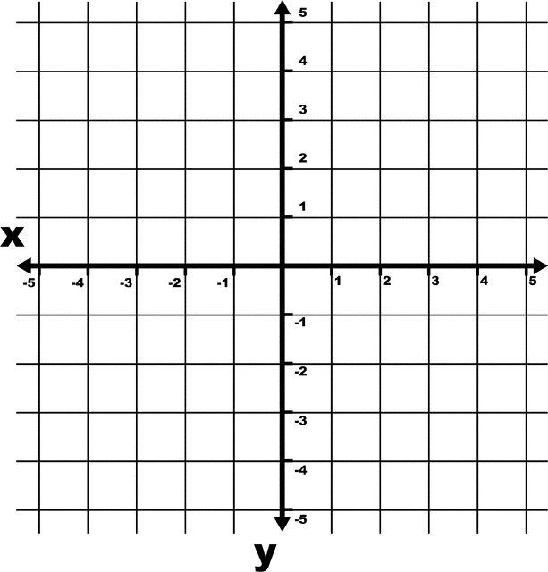

# Challenge #15 - X Marks the Perfect Shot 📸
With the city getting smarter, it's time to turn your focus to Codeville's biggest event of the year, the Harvest Festival! Each year, the Harvest Festival kicks off with a parade - and you want to make sure this is a show the townspeople will remember forever.

You've hired Daria Ducksworth, the town's best photographer, to capture the magic of the Harvest Festival Parade. She needs to track the coordinates of the floats to help her capture their best angles.

## Instructions
For this challenge you'll have to implement a function called `finalPosition()`, which will calculate the position of the parade based on an array of directional moves. The parade will move on an X-Y grid like the following.



Your function will receive an array of moves, which are strings that say either `north`, `south`, `west`, or `east`, these represent the parade moving in a particular direction by a single space on the grid. By looking at the path that the parade moves in, your function should calculate and then return an array representing the position of the parade after completing all of the moves. The first element of the array should be the X position, and the second element of the array should be the Y position. The parade begins at `[0,0]`.

## Examples

### Input:
```
const moves = ['north', 'north', 'west', 'west', 'north', 'east','north']
```

### Output:
```
[-1, 4]
```

# Hint
One way to approach this is to start with an array at [0, 0], and then update the appropriate values while looping through the moves. See if you can get the final X value first!

# Tests
- The function returns an array with two elements
- The proper X position is returned
- The proper Y position is returned
